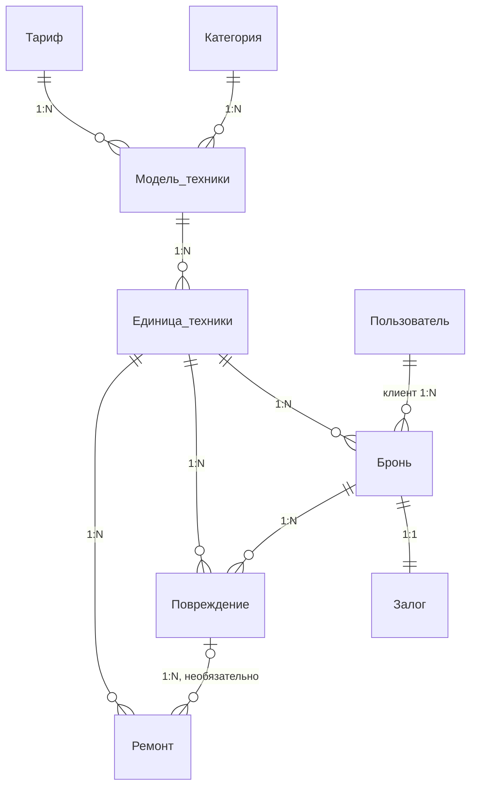

# Сервис проката техники: roadmap

Авторы: Георгий & Влад

## 1. Для чего

Сервис предназначен для небольших прокатов техники (PS5, проекторы, камеры, самокаты), которые сейчас ведут бронирования, залоги и состояние техники вручную, например через Авито и таблицы.

Из-за этого возникают типичные проблемы:

- одну и ту же технику бронируют двое на пересекающиеся даты;
- залог возвращают «на глаз», без записи о повреждениях;
- сломанную технику случайно выдают следующему клиенту;
- непонятно, какая техника простаивает, а какой не хватает.

Система позволяет:

- хранить каталог техники;
- создавать и отслеживать бронирования;
- проверять доступность техники на выбранные даты;
- учитывать стоимость аренды и залог;
- фиксировать повреждения и удержания из залога;
- отслеживать технику, находящуюся в ремонте.

Целевая аудитория — владельцы и менеджеры небольших прокатов техники, а также их клиенты.

## 2. Модель

Модель включает 9 сущностей. Клиент выбирает модель техники, а система подбирает свободную единицу. Повреждения и ремонты привязаны к конкретной единице, поэтому видна её история.

| Сущность | Что хранит | Связи |
| --- | --- | --- |
| Пользователь | имя, email, телефон, пароль, роль | 1:N броней |
| Категория | название: PS5, проекторы, камеры, самокаты | 1:N моделей |
| Тариф | цена за сутки, выходные, неделю; размер залога; штраф за час просрочки | 1:N моделей |
| Модель техники | название (Sony PS5 Slim, Canon R50), характеристики, фото | N:1 категория, N:1 тариф, 1:N единиц |
| Единица техники | конкретная PS5 или камера: серийный номер, состояние | N:1 модель, 1:N броней, повреждений и ремонтов |
| Бронь | клиент, единица техники, даты, стоимость, статус | N:1 клиент, N:1 единица, 1:1 залог, 1:N повреждений |
| Залог | сумма, возвращено, удержано, долг клиента, статус | 1:1 бронь |
| Повреждение | описание, стоимость ремонта, дата | N:1 единица, N:1 бронь, 1:N ремонтов |
| Ремонт | статус, даты начала и окончания | N:1 единица, N:1 повреждение (необязательно) |



Сверху каталог: категория и тариф задают модель, модель — единицы техники. Бронь связывает клиента с единицей и залогом, а повреждения и ремонты висят на единице.

## 3. Ролевая модель

В системе 3 роли. Права проверяются на бэкенде через middleware и Policies Laravel. Доставка курьером в первую версию не входит.

**Клиент**

- просмотр доступной техники и тарифов;
- создание брони;
- просмотр своих броней;
- отмена своей брони до выдачи.

**Менеджер**

- добавление и редактирование техники;
- управление бронями: подтверждение, выдача, отмена;
- оформление залога;
- оформление возврата;
- фиксация повреждений;
- отправка техники в ремонт и закрытие ремонта.

**Владелец**

- всё, что может менеджер;
- просмотр статистики;
- управление пользователями и ролями.

## 4. Стек и архитектура

Бэкенд пишем на PHP + Laravel, данные храним в MySQL.

```
Frontend: HTML + CSS + Blade
Backend: PHP 8.x + Laravel
Database: MySQL
ORM: Eloquent
Web-сервер: Apache
Локальная среда: XAMPP
Зависимости: Composer
Контроль версий: Git + GitHub
```

Внутри Laravel используем:

- миграции и сидеры — создание таблиц и тестовые данные;
- FormRequest — валидация входящих запросов;
- middleware и Policies — проверка прав по ролям;
- Scheduler — фоновая проверка просрочек.

Архитектура слоистая: контроллер принимает запрос, бизнес-логика живёт в сервисах, работа с базой вынесена в модели Eloquent и репозитории.

```
Frontend
   ↓
Controller
   ↓
Service
   ↓
Eloquent / Repository
   ↓
MySQL
```

Например, бронирование:

```
BookingController
       ↓
BookingService
   проверка дат
   проверка доступности
   блокировка техники в ремонте
   расчёт стоимости по тарифу
       ↓
Booking / Eloquent
       ↓
MySQL
```

Возврат техники проходит через ReturnService: он фиксирует повреждения, считает удержание из залога и при необходимости отправляет единицу в ремонт.

## 5. Бизнес-логика (Service-слой)

Основная логика живёт в сервисах, а не в контроллерах. Статусы меняются только по разрешённым переходам:

| Сущность | Статусы |
| --- | --- |
| Бронь | новая → подтверждена → выдана → возвращена → закрыта; «отменена» — только до выдачи; «просрочена» — выдана, срок истёк |
| Залог | принят → возвращён полностью / частично / удержан |
| Ремонт | в работе → завершён |
| Единица техники | в работе / в ремонте / списана |

Правила:

1. **Проверка доступности.** Единица свободна, если у неё нет активных броней на пересекающиеся даты и она не в ремонте. Между бронями закладывается буфер на проверку и зарядку.
2. **Автоподбор экземпляра.** Клиент выбирает модель, а система сама назначает свободную единицу этой модели.
3. **Расчёт стоимости.** Система подбирает самую дешёвую комбинацию тарифов: например, 9 суток = неделя + 2 суток. Период с пятницы по воскресенье считается по тарифу «выходные».
4. **Отмена.** Бронь можно отменить только до выдачи, клиент отменяет только свою.
5. **Залог.** Размер берётся из тарифа модели. При возврате клиент получает залог минус стоимость повреждений и штраф за просрочку. Если ущерб больше залога, разница записывается как долг, и пока он не погашен, новые брони клиенту недоступны.
6. **Просрочка.** Плановая задача (Laravel Scheduler) раз в час помечает просроченные брони и начисляет штраф по тарифу. Если на эту единицу есть следующая бронь, менеджер получает предупреждение.
7. **Повреждение и ремонт.** Если технику нужно чинить, создаётся ремонт, и единица становится недоступной. Её будущие брони переназначаются на свободные экземпляры той же модели, а если замены нет, менеджер получает уведомление.
8. **Статистика загрузки.** Для каждой единицы и модели считается доля дней в аренде и число ремонтов: видно, что простаивает и что чаще ломается.

## 6. Этапы разработки

Работа идёт в восемь этапов, и после каждого есть работающая часть, которую можно показать. Бэкенд пишут оба участника: один ведёт каталог и бронирование, другой — залоги, повреждения и ремонты.

1. **Окружение:** XAMPP, Composer, новый Laravel-проект, репозиторий на GitHub.
2. **База данных:** миграции 9 таблиц, связи в моделях Eloquent, сидеры с тестовыми данными.
3. **Авторизация и роли:** регистрация, вход, middleware и Policies.
4. **Каталог:** категории, тарифы, модели и единицы техники.
5. **Бронирование:** проверка доступности, автоподбор единицы, расчёт стоимости, статусы, отмена.
6. **Залог, возврат и ремонт:** удержания и долги, повреждения, ремонты, переназначение броней.
7. **Фоновые задачи и статистика:** проверка просрочек через Scheduler, загрузка техники.
8. **Фронтенд и демо:** интерфейсы для трёх ролей, прогон основных сценариев, подготовка к защите.
